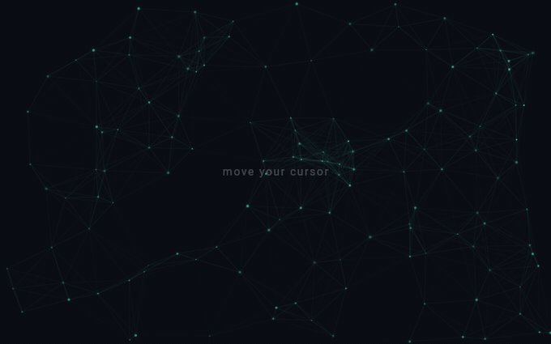

# constellation_particles

<p align="center">
  
</p>

A mouse-reactive constellation particle field for Flutter. Particles drift,
wrap at the edges, repel from the pointer, and link up with fading lines when
they get close. No plugins, no shaders, no runtime dependencies beyond Flutter.


## Why this exists

Connecting-line particle fields are everywhere, and most of them are quietly
O(n²): every frame each particle is distance-checked against every other
particle to decide whether to draw a line. At 100 particles that's ~5,000
checks a frame; the effect looks great in a demo and then drops frames the
moment you scale it up or put it behind real content.

This one buckets particles into a **spatial hash grid** whose cell size equals
the connection distance. A particle can only link to something in its own cell
or the eight around it, so each frame walks ~9 cells per particle instead of
the whole population. The line pass stays close to O(n), and the field holds
60fps with a few hundred particles on a mid web target.

A couple of other things it does so you don't have to:

- **Pauses** its ticker when the app is hidden or backgrounded.
- **Halves** the particle count when the platform requests high contrast.
- Caches paints and the glow gradient, and only repaints when the simulation
  actually advanced (`shouldRepaint` gates on a generation counter).
- Excludes itself from the semantics tree — it's decoration, not content.

## Install

```yaml
dependencies:
  constellation_particles: ^0.1.0
```

## Usage

Drop it into a `Stack` behind your content and give it a bounded size:

```dart
Stack(
  children: [
    const Positioned.fill(
      child: ConstellationParticles(),
    ),
    yourContent,
  ],
)
```

Tune it:

```dart
ConstellationParticles(
  particleCount: 160,
  color: const Color(0xFF64FFDA),
  speed: 1.2,
  connectionDistance: 140,
  repulsionRadius: 220,
)
```

## Parameters

| Parameter            | Default     | Description                                             |
| -------------------- | ----------- | ------------------------------------------------------- |
| `particleCount`      | `100`       | Particles at full density; halved under high contrast.  |
| `color`              | `0xFF64FFDA`| Base colour; per-particle/line opacity derived from it. |
| `speed`              | `1.0`       | Drift-speed multiplier.                                 |
| `connectionDistance` | `120.0`     | Max link distance, also the grid cell size.             |
| `repulsionRadius`    | `200.0`     | Pointer influence radius.                               |
| `repulsionForce`     | `50.0`      | Pointer push strength.                                  |
| `seed`               | `42`        | Layout seed; fixed by default for reproducible fields.  |

## Notes

- The field is pointer-driven, so the repulsion effect is desktop/web-first;
  on touch it simply drifts, which is the right default for a background.
- It renders into a `RepaintBoundary`, so it won't drag your content into its
  repaints.

## License

MIT © Yusuf İhsan Görgel
